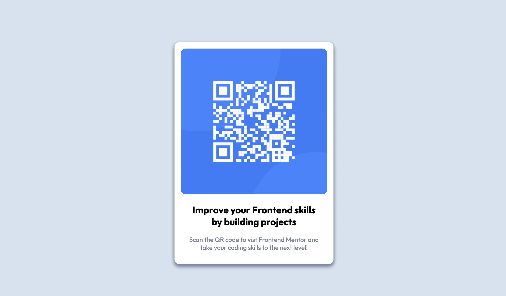

# Frontend Mentor - QR code component solution

This is a solution to the [QR code component challenge on Frontend Mentor](https://www.frontendmentor.io/challenges/qr-code-component-iux_sIO_H). Frontend Mentor challenges help you improve your coding skills by building realistic projects. 

## Table of contents

- [Overview](#overview)
  - [Screenshot](#screenshot)
  - [Links](#links)
- [My process](#my-process)
  - [Built with](#built-with)
  - [Useful resources](#useful-resources)
- [Author](#author)
- [Acknowledgments](#acknowledgments)

## Overview

QR code challenge

### Screenshot

### Links

- Solution URL: [solution repo](https://github.com/Pilks-pixel/qr-code)
- Live Site URL: [QR Code site](https://qrcode-fm-challenge.netlify.app/)

## My process

- Drew out solution, planing structure
- Wrote base HTML
- Started with global styles
- Utilised dev tools to create responsive design

### Built with

- Semantic HTML5 markup
- Flexbox
- CSS Grid
- Mobile-first workflow

### Useful resources

- [coolors color picker](https://coolors.co/) - This helped getting specific colors in the design.

## Author

- Website - [peterpilkington.com](https://www.peterpilkington.com/)

